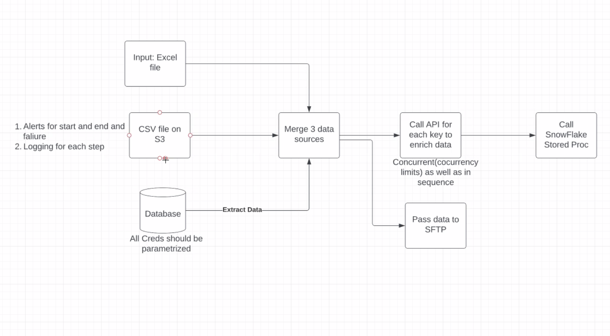

# dagster_etl_enrich_demo

This is a demo Dagster project based on the following pipeline:



This example highlights a few key pieces of Dagster:

1. Source assets are used to represent the Excel file, CSV file, and SQL table. These assets are loaded via IO Managers
2. All of the resources are parameterized. When the code runs locally, it uses local the local file system. When the code runs in production it uses S3. Similar parameterization of the Snowflake warehouse is possible.
3. The file inputs have default values, but runs can be launched with a different values. For example, to change the csv file path, select the assets and then "Shift + Click" on materialize. In the launchpad, add:

```
resources:
  csv_io:
    config:
      filename: customers2.csv
```

4. An API is used to enrich the data, row by row. In this example, a combination of a graph-backed asset and `DyanmicOutputs` is used to batch the data and then parallelize the enrichment. A smaller batch size equals more parallel runs _submitted_. The number of runs _actually executed_ in parallel at one time is controlled via config. For example, to run everything in sequence, select the assets and then "Shift + Click" on materialize. In the launchpad, add: 

```
execution:
  config:
    multiprocess:
      max_concurrent: 1
```

5. Secrets are loaded from AWS SecretManager using a helper function 

6. A final asset is created that represents a direct SQL statement, no data is loaded into dagster and no data is written out, but the asset is still run at the correct time with appropriate metadata


TODO: 

- [ ] Add scheduling, ideally via an asset reconciliation sensor and freshness policy 
- [ ] Add observable source assets to avoid un-necessary runs if the sources are the same
- [ ] Configure CloudWatch during deploy to Dagster Cloud Hybrid